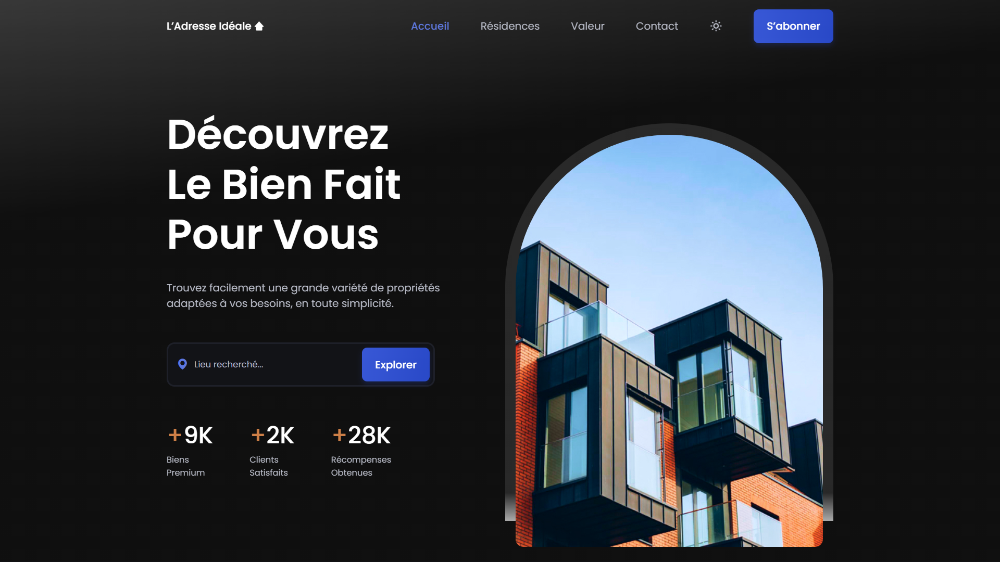

<div align="center">  
    <a href="https://real-estate-agency-vm.netlify.app/" target="_blank">  
        
    </a>
    </br>  
    </br>  
  <h3 align="center">🏡 L’Adresse Idéale &nbsp; — &nbsp; Agence Immobilière</h3>  
</div>

## <br /> 📌 Sommaire

&nbsp;&nbsp;&nbsp; 🎨 &nbsp; [**Introduction**](#introduction)<br />
&nbsp;&nbsp;&nbsp; 🛠️ &nbsp; [**Technologies**](#technologies)<br />
&nbsp;&nbsp;&nbsp; 🎯 &nbsp; [**Fonctionnalités**](#fonctionnalités)<br />
&nbsp;&nbsp;&nbsp; 🚀 &nbsp; [**Installation**](#installation)<br />

## <br /> <a name="introduction">🎨 Introduction</a>

L’Adresse Idéale est une landing page immobilière moderne et responsive pour mettre en avant des biens résidentiels. Design clair, animations fluides, FAQ interactive, carrousel Swiper, formulaire de contact complet et thème sombre activable.

## <br /> <a name="technologies">🛠️ Technologies</a>

- HTML5 sémantique et structuration claire
- CSS3 moderne avec variables, media queries et animations
- JavaScript ES6 clair et modulaire
- [Swiper.js](https://swiperjs.com/) pour les résidences populaires
- [ScrollReveal](https://scrollrevealjs.org/) pour des animations au scroll
- [Boxicons](https://boxicons.com/) pour des icônes vectorielles modernes
- Responsive Design pensé en mobile-first

## <br /> <a name="fonctionnalités">🎯 Fonctionnalités</a>

- Section d'accueil avec formulaire de recherche
- Slider des résidences populaires animé avec Swiper.js
- Section valeur avec accordéon interactif
- Logos partenaires avec effet d’opacité
- Formulaire de contact complet téléphone, email, etc...
- Section souscription à une offre immo
- Scroll dynamique et scroll-up visible
- Thème sombre activable et sauvegarde locale
- Responsive design adapté à tous les écrans

## <br /> <a name="installation">🚀 Installation</a>

### ✅ Prérequis

- [Google Chrome](https://www.google.com/) &nbsp;—&nbsp; Navigateur moderne
- [Visual Studio Code](https://code.visualstudio.com/) &nbsp;—&nbsp; Éditeur de code
- [Live Server](https://marketplace.visualstudio.com/items?itemName=ritwickdey.LiveServer) &nbsp;—&nbsp; Extension VS Code

### 📥 Cloner le projet

```bash
git clone git@github.com:ValentinMadiot/real-estate-agency_ui
cd real-estate-agency_ui
```

### ▶️ Lancer le projet

Il suffit d’ouvrir le fichier `index.html` dans un navigateur, ou d’utiliser l’extension **Live Server** sur VS Code pour un aperçu dynamique.
